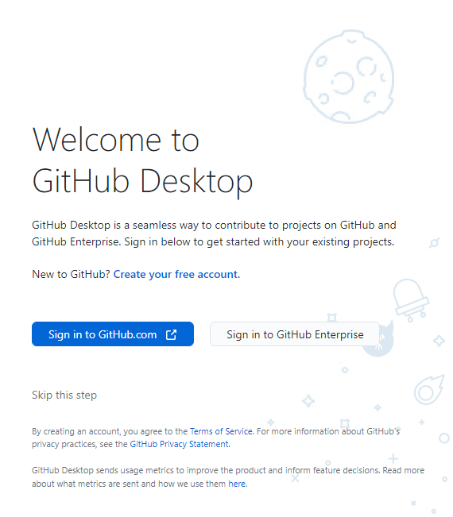
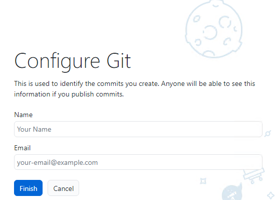

<text-box variant='learningObjectives' name="Learning objectives">

After this section

- You will know how to **install and configure Git** on your local machine.
- You will understand the role of **Git in version control** and how it integrates with **GitHub**.
- You will be able to **set up and authenticate GitHub in VS Code** for seamless collaboration.
- You will know how to **clone a GitHub repository**, make changes, and commit them back.
- You will be able to use **GitHub Codespaces** as an alternative cloud-based development environment.
- You will understand the differences between **local Git workflows** and **cloud-based workflows (Codespaces)**.

</text-box>

To work more effectively with GitHub, it’s essential to integrate it with an IDE like **VS Code**. There are two ways to do this:

---

## Method 1:  Local Setup
This method involves installing Git on your local machine and using the **GitHub Pull Request and Issues extension** in VS Code.

### **Steps to Set Up Git with VS Code:**
1. **Install Git** (Version Control System)  (if not installed)
   - Download and install Git from [Git Downloads](https://git-scm.com/downloads).
   - After installation, verify the installation by running:
     ```sh
     git --version
     ```

2. **Configure Git**

After installing Git, you need to configure Git by providing your full name and email address.You can start GitHub Desktop and configure using the graphical user interface as shown in the diagram below or use the command line.




***Configure Git with command line***

1. Open Git Bash.
2. Set your username and email, which will be associated with your commits. Use these commands, replacing "Your Name" and "your.email@example.com" with your actual information:

```bash
git config --global user.name "Your Name"
git config --global user.email your.email@example.com
```
***Check your Git Configuration***

```bash
git config --list
```

3. **Install VS Code** (if not installed)
   - Download it from [Visual Studio Code](https://code.visualstudio.com/).

4. **Install GitHub Pull Request and Issues Extension**
   - Open VS Code and go to the **Extensions Marketplace** (`Ctrl + Shift + X` / `Cmd + Shift + X` on macOS).
   - Search for **GitHub Pull Requests and Issues** and install it.
   - Alternatively, install it directly from [VS Code Extensions](https://marketplace.visualstudio.com/items?itemName=GitHub.vscode-pull-request-github).

5. **Authenticate GitHub in VS Code**
   - Open VS Code and navigate to:
     ```
     View > Command Palette (Ctrl + Shift + P / Cmd + Shift + P on macOS)
     ```
   - Search for **"GitHub: Sign in to GitHub"** and follow the prompts.

6. **Clone a GitHub Repository into VS Code**
   - Open VS Code and open the **Command Palette**.
   - Select **"Git: Clone"** and enter the repository URL from GitHub.  (Example Repo Link: https://github.com/Laurea-amk-Leppavaara/github-starter-space)
   - Choose a local folder to save the repository and start coding.

**Read More: For full instructions, refer to the official VS Code guide:**
 [Collaborate on GitHub](https://code.visualstudio.com/docs/sourcecontrol/github)

---

## Method 2: Using GitHub Codespaces (Cloud-Based IDE)
**GitHub Codespaces** is a cloud-based development environment that allows you to code directly in your browser without installing anything locally.

### **Benefits of GitHub Codespaces:**
- No installation required
- Access your code from any device
- Standardized development environment

### **How to Use GitHub Codespaces:**
1. Go to your GitHub repository.
2. Click the **"Code"** button and select the **"Codespaces"** tab.
3. Click **"New codespace"** to launch a fully configured VS Code environment in your browser.

**Watch this short video on how to use GitHub Codespaces:**

<iframe width="560" height="315" src="https://www.youtube.com/embed/SVaqUjBUdMA?si=nrMV2p9_zsw7Ry-d" title="YouTube video player" frameborder="0" allow="accelerometer; autoplay; clipboard-write; encrypted-media; gyroscope; picture-in-picture; web-share" referrerpolicy="strict-origin-when-cross-origin" allowfullscreen></iframe>

 **For more details, visit the official documentation:**
 [GitHub Codespaces](https://docs.github.com/en/codespaces)

---

###  **Which Method Should You Use?**
- **Use the local method** if you prefer working locally and need **full control over your development environment**.
- **Use GitHub Codespaces** if you want to **code from anywhere** without worrying about installations.

##  Basic Git Command Line Reference

Here are some essential Git commands to get started:

| Command | Description |
|---------|-------------|
| `git --version` | Check if Git is installed |
| `git config --global user.name "Your Name"` | Set your Git username |
| `git config --global user.email "your-email@example.com"` | Set your Git email (must match GitHub) |
| `git config --list` | View your Git configuration |
| `git init` | Initialize a new Git repository in a folder |
| `git clone <repo-url>` | Clone a repository from GitHub |
| `git status` | Check the status of your working directory |
| `git add <file>` | Stage a file for commit |
| `git add .` | Stage all modified files for commit |
| `git commit -m "Your commit message"` | Commit changes with a message |
| `git log --oneline --graph --all` | View commit history in a readable format |
| `git branch` | List all branches in the repository |
| `git checkout -b <branch-name>` | Create and switch to a new branch |
| `git merge <branch-name>` | Merge a branch into the current branch |
| `git push origin <branch-name>` | Push changes to GitHub |
| `git pull origin <branch-name>` | Pull the latest changes from GitHub |
| `git remote -v` | Show linked remote repositories |
| `git reset --hard <commit-id>` | Reset to a specific commit (dangerous, use with caution) |

 **For a complete list of Git commands, check the official Git documentation:**
 [Git Command Reference](https://git-scm.com/docs)
